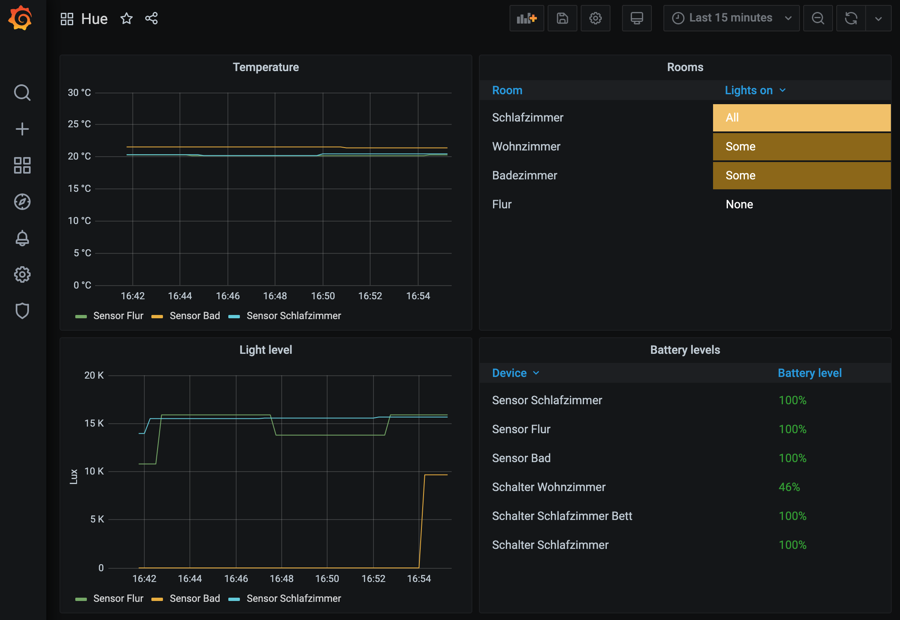

# Grafana, Prometheus & hue_export in one docker-compose file

Deploy a dashboard for your Philips Hue devices with just one docker-compose file.

## Steps

1. Set the `ip_address` in `./docker-compose/hue_exporter/config.yml` to the IP address of your Hue bridge (Hue App for Android/iOS shows it on the settings page)
2. Generate a token to access the bridge API by pressing the link button on your bridge and then running `curl --data "{\"devicetype\": \"homematic#homematic\"}" http://<ip-of-your-bridge>/api` within 30 seconds after pressing the button.
3. Set `api_key: "your-bridge-token"` in `./docker-compose/hue_exporter/config.yml`
4. Run `docker-compose up`
5. Go to `localhost:3000` and login with `user: admin, password: admin`
6. Optional (but recommended): Change the login credentials in the Grafana settings to something more secure.
7. Add prometheus as a datasource in Grafana: Click on the gear-icon, go to data sources, add prometheus with this url: `http://prometheus:9090` and hit save
8. Import the dashboard config into grafana: Click on the plus-icon in the sidebar, then import, paste in the JSON from `./docs/grafana.json` and hit save.
9. Done 🚀

Your Dashboard should now look like this (depending on the devices you have):

## On ARM (e.g. Raspberry Pi)

Replace the command in step 4 with `docker-compose -f arm.yml up`.
